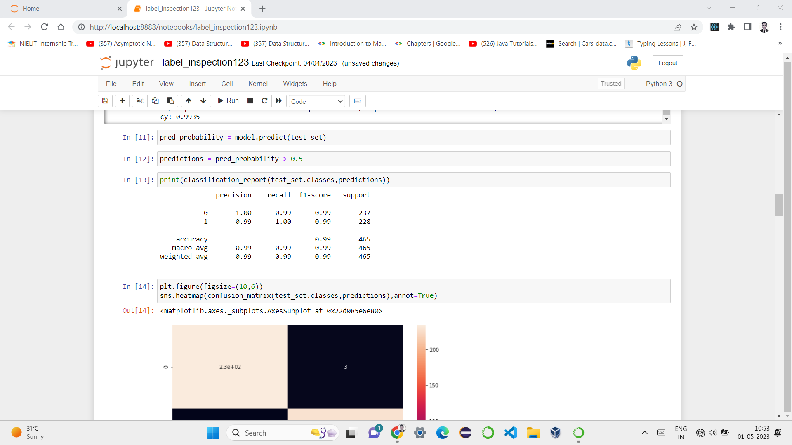

  
#         Label Inspection System


##  Table Of Contents
• [Overview](#overview) 
• [Features](#features) 
• [Technologies](#technologies) 
• [Setup and Installation](#setup-and-installation) 
• [Model Architecture](#model-architecture) 
• [Dataset](#dataset) 
• [Evaluation](#evaluation)
• [Demonstration](#demonstration) 
• [Result](#result)

## Overview
This project uses a Convolutional Neural Network (CNN) to develop a real-time Label Inspection System that identifies defective labels. The system is built with OpenCV for image processing and TensorFlow for deep learning. It leverages a custom-trained CNN model to classify labels as either defective or non-defective based on images captured in real-time from cameras or input through other sources.
## Features

- Real-time defect detection: Utilizes live image feeds for immediate detection of label defects.
- Deep learning model: Trained on labeled image data using a CNN, ensuring high accuracy in defect identification.
- Early stopping: Optimizes training time and prevents overfitting by utilizing early stopping mechanisms during model training.
- Performance metrics: Evaluates model accuracy using confusion matrices and classification reports.


## Technologies
### Technologies

- **Python**: Core programming language.
- **OpenCV**: Image processing and computer vision.
- **TensorFlow & Keras**: For building and training the CNN model.
- **NumPy, Pandas**: Data handling.
- **Matplotlib, Seaborn**: Visualization.

## Setup and Installation


#### Prerequisites:
- **Python 3.x**: The core language required to run the project.
- **TensorFlow**: For building and training the CNN model.
- **OpenCV**: For image processing and real-time computer vision tasks.
- **Matplotlib**: For plotting and visualizing data.

#### Installation Steps:
1. **Clone the repository**:
   ```bash
   git clone https://github.com/HemantTanawade/label-inspection.git


After installing the prerequisites, ensure you import the necessary libraries in your code:

```python
import os
import pandas as pd
import numpy as np
import seaborn as sns
import matplotlib.pyplot as plt
from matplotlib.image import imread
import cv2
```
```
from tensorflow.keras.preprocessing.image import ImageDataGenerator, load_img, img_to_array
from tensorflow.keras.models import Sequential
from tensorflow.keras.layers import Activation, Dropout, Flatten, Dense, Conv2D, MaxPooling2D
from tensorflow.keras.callbacks import EarlyStopping
from sklearn.metrics import classification_report, confusion_matrix
```


##  Model Architecture
Detail the CNN architecture you used, including the number of layers, activations, and pooling layers. Example:

Conv2D -> ReLU Activation -> MaxPooling2D
Dropout -> Flatten -> Dense -> Softmax


## Dataset
The dataset used for training and evaluating the Label Inspection System consists of images of labels, both defective and non-defective. Below are the key details about the dataset:

### 1. Data Source
- **Source**: 

### 2. Data Structure
- **Image Format**: JPEG.
- **Resolution**: Dimensions of the images 217*500.
- **Classes**: 
  - Defective labels 
  - ok labels

### 3. Number of Samples
- **Total training Images**: Total number of images in the training dataset.
  -1,177 images total (603 defective, 574 ok).
- **Total testing Images**: Total number of images in the testing dataset.
  -1,177 images total (603 defective, 574 ok).

## Evaluation!
## Sample Outputs

Here are some sample outputs from the Label Inspection System:

### Defective Label Detected


### Proper Label Detected


 
## Demonstration

You can view the demonstration video of the Label Inspection System 
[here](https://youtu.be/_ywLO1vzUc4?si=KqAjs7iFajGG_tq1)


## Result
.
